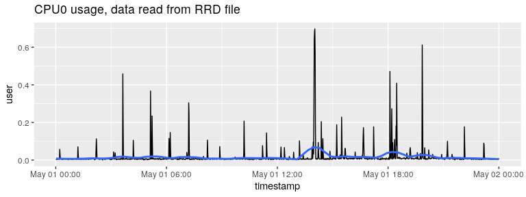

<!-- README.md is generated from README.Rmd. Please edit that file -->

# rrd 

<!-- badges: start -->

[](https://github.com/andrie/rrd/actions)
[](https://cran.r-project.org/package=rrd)
[](https://lifecycle.r-lib.org/articles/stages.html)
[](https://www.r-pkg.org:443/pkg/rrd)
[](https://www.r-pkg.org:443/pkg/rrd)
[](https://app.codecov.io/gh/andrie/rrd?branch=main)

<!-- badges: end -->

The `rrd` package allows you to read data from an
[RRD](https://oss.oetiker.ch/rrdtool/) Round Robin Database.

## Installation

### System requirements

In order to build the package from source you need
[librrd](https://oss.oetiker.ch/rrdtool/doc/librrd.en.html). Installing
[RRDtool](https://oss.oetiker.ch/rrdtool/) from your package manager
will usually also install the library.

| Platform        | Installation                 |
| --------------- | ---------------------------- |
| Debian / Ubuntu | `apt-get install librrd-dev` |
| RHEL / CentOS   | `yum install rrdtool-devel`  |
| Fedora          | `yum install rrdtool-devel`  |
| Solaris / CSW   | Install `rrdtool`            |
| OSX             | `brew install rrdtool`       |
| Windows         | Not available                |

Note: on OSX you may have to update `xcode`, using `xcode-select
--install`.

### Package installation

You can install the stable version of the package from CRAN:

``` r
install.packages("rrd")
```

And the development version from [GitHub](https://github.com/):

``` r
# install.packages("remotes")
remotes::install_github("andrie/rrd")
```

## About RRD and RRDtool 

The `rrd` package is a wrapper around `RRDtool`. Internally it uses
[librrd](https://oss.oetiker.ch/rrdtool/doc/librrd.en.html) to import
the binary data directly into R without exporting it to an intermediate
format first.

For an introduction to RRD database, see
<https://oss.oetiker.ch/rrdtool/tut/rrd-beginners.en.html>

## Example

The package contains some example RRD files that originated in an
instance of RStudio Connect. In this example, you analyze CPU data in
the file `cpu-0.rrd`.

Load the package and assign the location of the `cpu-0.rrd` file to a
variable:

``` r
library(rrd)
rrd_cpu_0 <- system.file("extdata/cpu-0.rrd", package = "rrd")
```

To describe the contents of an RRD file, use `describe_rrd()`:

``` r
describe_rrd(rrd_cpu_0)
#> An RRD file with 10 RRA arrays and step size 60
#> [1] AVERAGE_60 (43200 rows)
#> [2] AVERAGE_300 (25920 rows)
#> [3] MIN_300 (25920 rows)
#> [4] MAX_300 (25920 rows)
#> [5] AVERAGE_3600 (8760 rows)
#> [6] MIN_3600 (8760 rows)
#> [7] MAX_3600 (8760 rows)
#> [8] AVERAGE_86400 (1825 rows)
#> [9] MIN_86400 (1825 rows)
#> [10] MAX_86400 (1825 rows)
```

To read an entire RRD file, i.e. all of the RRA archives, use
`read_rrd()`. This returns a list of `tibble` objects:

``` r
cpu <- read_rrd(rrd_cpu_0)

str(cpu, max.level = 1)
#> List of 10
#>  $ AVERAGE60   : tibble [43,199 × 9] (S3: tbl_df/tbl/data.frame)
#>  $ AVERAGE300  : tibble [25,919 × 9] (S3: tbl_df/tbl/data.frame)
#>  $ MIN300      : tibble [25,919 × 9] (S3: tbl_df/tbl/data.frame)
#>  $ MAX300      : tibble [25,919 × 9] (S3: tbl_df/tbl/data.frame)
#>  $ AVERAGE3600 : tibble [8,759 × 9] (S3: tbl_df/tbl/data.frame)
#>  $ MIN3600     : tibble [8,759 × 9] (S3: tbl_df/tbl/data.frame)
#>  $ MAX3600     : tibble [8,759 × 9] (S3: tbl_df/tbl/data.frame)
#>  $ AVERAGE86400: tibble [1,824 × 9] (S3: tbl_df/tbl/data.frame)
#>  $ MIN86400    : tibble [1,824 × 9] (S3: tbl_df/tbl/data.frame)
#>  $ MAX86400    : tibble [1,824 × 9] (S3: tbl_df/tbl/data.frame)
```

Since the resulting object is a list of `tibble`s, you can easily work
with individual data frames:

``` r
names(cpu)
#>  [1] "AVERAGE60"    "AVERAGE300"   "MIN300"       "MAX300"       "AVERAGE3600" 
#>  [6] "MIN3600"      "MAX3600"      "AVERAGE86400" "MIN86400"     "MAX86400"

cpu[[1]]
#> # A tibble: 43,199 × 9
#>    timestamp              user     sys  nice  idle  wait   irq softirq   stolen
#>    <dttm>                <dbl>   <dbl> <dbl> <dbl> <dbl> <dbl>   <dbl>    <dbl>
#>  1 2018-04-02 12:24:00 0.0104  0.00811     0 0.981     0     0       0 0.000137
#>  2 2018-04-02 12:25:00 0.0126  0.00630     0 0.979     0     0       0 0.00192 
#>  3 2018-04-02 12:26:00 0.0159  0.00808     0 0.976     0     0       0 0       
#>  4 2018-04-02 12:27:00 0.00853 0.00647     0 0.985     0     0       0 0       
#>  5 2018-04-02 12:28:00 0.0122  0.00999     0 0.978     0     0       0 0       
#>  6 2018-04-02 12:29:00 0.0106  0.00604     0 0.983     0     0       0 0       
#>  7 2018-04-02 12:30:00 0.0147  0.00427     0 0.981     0     0       0 0.000137
#>  8 2018-04-02 12:31:00 0.0193  0.00767     0 0.971     0     0       0 0.00191 
#>  9 2018-04-02 12:32:00 0.0300  0.0274      0 0.943     0     0       0 0       
#> 10 2018-04-02 12:33:00 0.0162  0.00617     0 0.978     0     0       0 0.000137
#> # … with 43,189 more rows
#> # ℹ Use `print(n = ...)` to see more rows

tail(cpu$AVERAGE60$sys)
#> [1] 0.0014390667 0.0020080000 0.0005689333 0.0000000000 0.0014390667
#> [6] 0.0005689333
```

To read a single RRA archive from an RRD file, use `read_rra()`. To use
this function, you must specify several arguments that define the
specific data to retrieve. This includes the consolidation function
(e.g. “AVERAGE”) and time step (e.g. 60), the `end` time. You must also
specifiy either the `start` time, or the number of steps, `n_steps`.

In this example, you extract the average for 1 minute periods (`step
= 60`), for one entire day (`n_steps = 24 * 60`):

``` r
end_time <- as.POSIXct("2018-05-02") # timestamp with data in example
avg_60 <- read_rra(rrd_cpu_0, cf = "AVERAGE", step = 60, n_steps = 24 * 60,
                     end = end_time)

avg_60
#> # A tibble: 1,440 × 9
#>    timestamp              user     sys  nice  idle    wait   irq softirq  stolen
#>    <dttm>                <dbl>   <dbl> <dbl> <dbl>   <dbl> <dbl>   <dbl>   <dbl>
#>  1 2018-05-01 00:01:00 0.00458 2.01e-3     0 0.992 0           0       0 1.44e-3
#>  2 2018-05-01 00:02:00 0.00258 5.70e-4     0 0.996 0           0       0 5.70e-4
#>  3 2018-05-01 00:03:00 0.00633 1.44e-3     0 0.992 0           0       0 0      
#>  4 2018-05-01 00:04:00 0.00515 2.01e-3     0 0.991 0           0       0 1.44e-3
#>  5 2018-05-01 00:05:00 0.00402 5.69e-4     0 0.995 0           0       0 5.69e-4
#>  6 2018-05-01 00:06:00 0.00689 1.44e-3     0 0.992 0           0       0 0      
#>  7 2018-05-01 00:07:00 0.00371 2.01e-3     0 0.993 1.44e-3     0       0 0      
#>  8 2018-05-01 00:08:00 0.00488 2.01e-3     0 0.993 5.69e-4     0       0 0      
#>  9 2018-05-01 00:09:00 0.00748 5.68e-4     0 0.992 0           0       0 0      
#> 10 2018-05-01 00:10:00 0.00516 0           0 0.995 0           0       0 0      
#> # … with 1,430 more rows
#> # ℹ Use `print(n = ...)` to see more rows
```

And you can easily plot using your favourite packages:

``` r
library(ggplot2)
ggplot(avg_60, aes(x = timestamp, y = user)) + 
  geom_line() +
  stat_smooth(method = "loess", span = 0.125, se = FALSE) +
  ggtitle("CPU0 usage, data read from RRD file")
#> `geom_smooth()` using formula 'y ~ x'
```



## More information

For more information on `rrdtool` and the `rrd` format please refer to
the official [rrdtool
documentation](https://oss.oetiker.ch/rrdtool/doc/index.en.html) and
[tutorials](https://oss.oetiker.ch/rrdtool/tut/index.en.html).

You can also read a more in-depth description of the package in an [R
Views](https://rviews.rstudio.com/) blog post [Reading and analyzing log
files in the RRD database
format](https://rviews.rstudio.com/2018/06/20/reading-rrd-files/).
