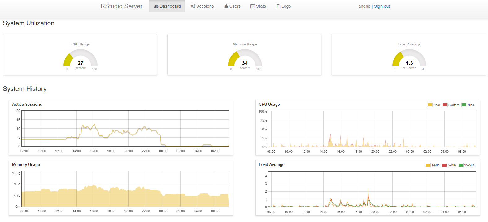

```{r, include = FALSE}
knitr::opts_chunk$set(
  collapse = TRUE,
  comment = "#>"
)
```

```{r setup}
library(rrd)
library(magrittr)
library(ggplot2)
```

I have frequent conversations with R champions and Systems Administrators responsible for R, in which they ask how they can measure and analyze the usage of their servers.  Among the many solutions to this problem, one of the my favourites is to use an **RRD** database and **RRDtool**.

From [Wikipedia](https://en.wikipedia.org/wiki/RRDtool):

> **RRDtool** (*round-robin database tool*) aims to handle time series data such as network bandwidth, temperatures or CPU load. The data is stored in a [circular buffer](https://en.wikipedia.org/wiki/Circular_buffer) based [database](https://en.wikipedia.org/wiki/Database), thus the system storage footprint remains constant over time. 

[RRDtool](https://oss.oetiker.ch/rrdtool/index.en.html) is a library written in C, with implementations that can also be accessed from the Linux command line. This makes it convenient for system development, but makes it difficult for R users to extract and analyze this data.

I am pleased to announce that I've been working on the `rrd` [R package](https://github.com/andrie/rrd) to import RRD files directly into `tibble` objects, thus making it easy to analyze your metrics.

As an aside, the RStudio Pro products (specifically [RStudio Server Pro](https://www.rstudio.com/products/rstudio-server-pro/) and [RStudio Connect](https://www.rstudio.com/products/connect/)) also make use of RRD to store metrics -- more about this later.

## Understanding the RRD format as an R user

The name RRD is an initialism of **R**ound **R**obin **D**atabase.  The "round robin" refers to the fact that the database is always fixed in size, and as a new entry enters the database, the oldest entry is discarded. In practical terms, the database collects data for a fixed period of time, and information that is older than the threshold gets removed.


A second quality of RRD databases is that each datum is stored in different "consolidation data points", where every data point is an aggregation over time. For example, a data point can represent an average value for the time period, or a maximum over the period.  Typical consolidation functions include `average`, `min` and  `max`.

The third quality is that every RRD database file typically consists of multiple archives. Each archive measures data for a different time period. For instance, the archives can capture data for intervals of 10 seconds, 30 seconds, 1 minute or 5 minutes.

As an example, here is a description of an RRD file that originated in RStudio Connect:

```
describe_rrd("rrd_cpu_0")
#> A RRD file with 10 RRA arrays and step size 60
#> [1] AVERAGE_60 (43200 rows)
#> [2] AVERAGE_300 (25920 rows)
#> [3] MIN_300 (25920 rows)
#> [4] MAX_300 (25920 rows)
#> [5] AVERAGE_3600 (8760 rows)
#> [6] MIN_3600 (8760 rows)
#> [7] MAX_3600 (8760 rows)
#> [8] AVERAGE_86400 (1825 rows)
#> [9] MIN_86400 (1825 rows)
#> [10] MAX_86400 (1825 rows)
```

This `RRD` file contains data for the properties of CPU 0 of the system.  In this example, the first `RRA` archive contains averaged metrics for one minute (60s) intervals, while the second `RRA` measures the same metric, but averaged over five minutes.  The same metrics are also available for intervals of one hour and one day.

Notice also that every archive has a different number of rows, representing a different historical period where the data is kept.  For example, the *per minute* data `AVERAGE_60` is retained for 43,200 periods (12 days) while the *daily* data `MAX_86400` is retained for 1,825 periods (5 years).

If you want to know more, please read the excellent [introduction tutorial](https://oss.oetiker.ch/rrdtool/tut/rrdtutorial.en.html) to RRD database.

## Introducing the `rrd` package

Until recently, it wasn't easy to import RRD files into R.  But I was pleased to discover that a [Google Summer of Code 2014](https://www.google-melange.com/archive/gsoc/2014) project created a proof-of-concept R package to read these files.  The author of this package is [Plamen Dimitrov](http://plamendimitrov.net/), who published the code on [GitHub](https://github.com/pldimitrov/Rrd) and also wrote an [explanatory blog post](http://plamendimitrov.net/blog/2014/08/09/r-package-for-working-with-rrd-files/).

Because I had to provide some suggestions to our customers, I decided to update the package, provide some example code, and generally improve the reliability.

The result is not yet on CRAN, but you can install the development version of package from [github](https://github.com/andrie/rrd).

### Installing the package

To build the package from source, you first need to install [librrd](http://oss.oetiker.ch/rrdtool/doc/librrd.en.html). Installing [RRDtool](http://oss.oetiker.ch/rrdtool/) from your Linux package manager will usually also install this library.

Using Ubuntu:

```sh
sudo apt-get install rrdtool librrd-dev
```

Using RHEL / CentOS:

```sh
sudo yum install rrdtool rrdtool-devel
```

Once you have the system requirements in place, you can install the development version of the R package from [GitHub](https://github.com/andrie/rrd) using:

```r
# install.packages("devtools")
devtools::install_github("andrie/rrd")
```

### Limitations

The package is not yet available for Windows.

### Using the package

Once you've installed the package, you can start to use it. The package itself contains some built-in RRD files, so you should be able to run the following code directly.

```{r}
library(rrd)
```

#### Describing the contents of a RRD

To describe the contents of an RRD file, use `describe_rrd()`. This function reports information about the names of each archive (RRA) file, the consolidation function, and the number of observations:

```{R}
rrd_cpu_0 <- system.file("extdata/cpu-0.rrd", package = "rrd")

describe_rrd(rrd_cpu_0)
```

#### Reading an entire RRD file

To read an entire RRD file, i.e. all of the RRA archives, use `read_rrd()`. This returns a list of `tibble` objects:

```{R}
cpu <- read_rrd(rrd_cpu_0)

str(cpu, max.level = 1)
```

Since the resulting object is a list of `tibble` objects, you can easily use R functions to work with an individual archive:

```{R}
names(cpu)
```

To inspect the contents of the first archive (`AVERAGE60`), simply print the object - since it's a `tibble`, you get 10 lines of output.

For example, the CPU metrics contains a time stamp and metrics for average *user* and *sys* usage, as well as the [*nice*](https://en.wikipedia.org/wiki/Nice_(Unix)) value, *idle* time, [*interrupt requests*](https://en.wikipedia.org/wiki/Interrupt_request_(PC_architecture)) and *soft interrupt requests*:

```{R}
cpu[[1]]
```

Since the data is in `tibble` format, you can easily extract specific data, e.g., the last values of the system usage:

```{R}
tail(cpu$AVERAGE60$sys)
```

#### Reading only a single archive

The underlying code in the `rrd` package is written in C, and is therefore blazingly fast. Reading an entire RRD file takes a fraction of a second, but sometimes you may want to extract a specific RRA archive immediately.

To read a single RRA archive from an RRD file, use `read_rra()`. To use this function, you must specify several arguments that define the specific data to retrieve. This includes the consolidation function (e.g., `"AVERAGE"`) and time step (e.g., `60`). You must also specify either the `start` time or the number of steps, `n_steps`.

In this example, I extract the average for one-minute periods (`step = 60`) for one day (`n_steps = 24 * 60`):

```{R}
end_time <- as.POSIXct("2018-05-02") # timestamp with data in example
avg_60 <- read_rra(rrd_cpu_0, cf = "AVERAGE", step = 60, n_steps = 24 * 60,
                     end = end_time)

avg_60
```

#### Plotting the results

The original `RRDTool` library for Linux contains some functions to [easily plot](https://oss.oetiker.ch/rrdtool/gallery/index.en.html) the RRD data, a feature that distinguishes RRD from many other databases.

However, R already has very rich plotting capability, so the `rrd` R package doesn't expose any specific plotting functions.

For example, you can easily plot these data using your favourite packages, like `ggplot2`:

```{R}
library(ggplot2)
ggplot(avg_60, aes(x = timestamp, y = user)) + 
  geom_line() +
  stat_smooth(method = "loess", span = 0.125, se = FALSE) +
  ggtitle("CPU0 usage, data read from RRD file")
```


## 

## Getting the RRD files from RStudio Server Pro and RStudio Connect

As I mentioned in the introduction, both [RStudio Server Pro](https://www.rstudio.com/products/rstudio-server-pro/) and [RStudio Connect](https://www.rstudio.com/products/connect/) use RRD to store metrics. In fact, these metrics are used to power the administration dashboard of these products.

This means that often the easiest solution is simply to enable the admin dashboard and view the information there.



However, sometimes R users and system administrators have a need to analyze the metrics in more detail, so in this section, I discuss where you can find the files for analysis.

The administration guides for these products explain where to find the metrics files:

* The admin guide for **RStudio Server Pro** discusses metrics in this in section [8.2 Monitoring Configuration](http://docs.rstudio.com/ide/server-pro/auditing-and-monitoring.html#monitoring-configuration).
  * By default, the metrics are stored at `/var/lib/rstudio-server/monitor/rrd`, although this path is configurable by the server administrator
  * RStudio Server Pro stores system metrics as well as user metrics
* **RStudio Connect** discusses metrics in section [16.1 Historical Metrics](http://docs.rstudio.com/connect/admin/historical-information.html#metrics)
  * The default path for metrics logs is `/var/lib/rstudio-connect/metrics`, though again, this is configurable by the server administrator.

```{R}
rsc <- "/var/lib/rstudio-connect/metrics/rrd"
rsp <- "/var/lib/rstudio-server/monitor/rrd"
```

If you want to analyze these files, it is best to copy the files to a different location.  The security and permissions on both products are configured in such a way that it's not possible to read the files while they are in the original folder. Therefore, we recommend that you copy the files to a different location and do the analysis there.

### Warning about using the RStudio Connect RRD files:

The RStudio Connect team is actively planning to change the way content-level metrics are stored, so data related to shiny apps, markdown reports, etc. will likely look different in a future release.

To be clear:

* The schemas might change
* RStudio Connect may stop tracking some metrics
* It's also possible that the entire mechanism might change

The only guarantees that we make in RStudio Connect are around the data that we actually surface:

- server-wide user counts
- RAM
- CPU data

This means that if you analyze RRD files, you should be aware that **the entire mechanism for storing metrics might change in future**.

### Additional caveat

* The metrics collection process runs in a sandboxed environment, and it is not possible to publish a report to RStudio Connect that reads the metrics directly. If you want to automate a process to read the Connect metrics, you will have to set up a [cron](https://en.wikipedia.org/wiki/Cron) job to copy the files to a different location, and run the analysis against the copied files. (Also, re-read the warning that everything might change!)

### Example

In the following worked example, I copied some `rrd` files that originated in RStudio Connect to a different location on disk, and stored this in a [`config`](https://github.com/rstudio/config) file.

First, list the file names:


```{R}
rrd_location <- system.file("extdata", package = "rrd")
rrd_location %>% 
  list.files()
```

The file names indicated that RStudio Connect collects metrics for the system (CPU, RAM, etc.), as well as for every piece of published content.

To look at the system load, first describe the contents of the `"system.load.rrd"` file:


```{R}
sys_load <- file.path(rrd_location, "content-1.rrd")
describe_rrd(sys_load)
```


This output tells you that metrics are collected every 60 seconds (one minute), and then in selected multiples (1 minute, 5 minutes, 1 hour and 1 day.) You can also tell that the consolidation functions are `average`, `min` and `max`.

To extract one month of data, averaged at 5-minute intervals use `step = 300`:

```{R}
dat <- read_rra(sys_load, cf = "AVERAGE", step = 300L, n_steps = (3600 / 300) * 24 * 30)
dat
```

It is very easy to plot this using your preferred plotting package, e.g., `ggplot2`:

```{R, eval=FALSE}
ggplot(dat, aes(x = timestamp, y = `5min`)) + 
  geom_line() + 
  stat_smooth(method = "loess", span = 0.125)
```


## Conclusion

The `rrd` package, available from [GitHub](https://github.com/andrie/rrd), makes it very easy to read metrics stored in the RRD database format. Reading an archive is very quick, and your resulting data is a `tibble` for an individual archive, or a list of `tibble`s for the entire file.

This makes it easy to analyze your data using the `tidyverse` packages, and to plot the information.